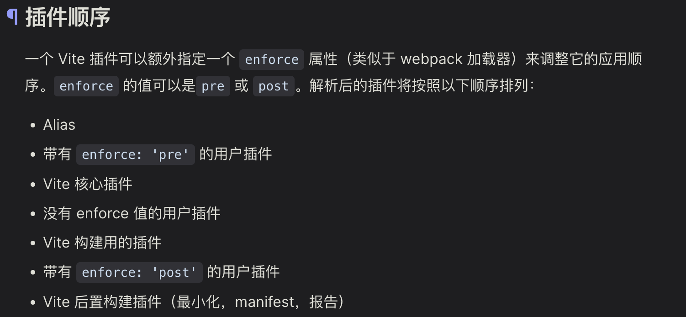

# vite 插件

## [vite-aliases](https://github.com/subwaytime/vite-aliases)
### 概述
帮助我们自动生成别名：检测当前目录下包括 /src 在内的所有文件夹，并帮助我们生成别名

> 【注意】0.11.1 的版本使用的时候有点问题，推荐使用 0.9.2 版本

### 手写实现
思路：在 vite 执行配置文件（vite.config.js）之前，改写配置文件，将生成的别名配置按照配置文件中 resolve 的格式注入到配置对象中。
> Vite 会把 vite.config.js 中定义的配置对象和插件的 config 生命周期钩子函数中返回的配置对象进行 merge 合并，形成最终的配置对象。 ==> { ...defaultConfig, ...specifyConfig }

## [vite-plugin-html](https://github.com/vbenjs/vite-plugin-html)
手撕该插件涉及到 vite 的生命周期钩子函数：transformIndexHtml、ejs 语法以及 vite 各类插件的执行顺序
> ejs 语法： [EJS 中文文档](https://ejs.bootcss.com/)。
一种服务端常用的模板语法，常用来在服务端动态更改文件内容，如打包后的 index.html 文件。

 

## [vite-plugin-mock](https://github.com/vbenjs/vite-plugin-mock/tree/main#readme)
基于 [mockJs](https://github.com/nuysoft/Mock/wiki) 的一个数据接口模拟请求的插件。

## Plugins 实现原理
在本地 vite 服务器内部可以获取到 viteConfig 配置信息（require），遍历其中的 viteConfig.plugins 并在对应时间点调用其内部的钩子函数。比如会先执行 config 钩子函数，之后会通过 Object.assign({}, defaultConfig, viteConfig, terminalConfig) 拿到最终的配置信息。之后再调用 configResolved 等其他的钩子函数。